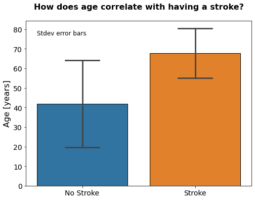

# Stroke Predictor

## Analysis and Classification of Strokes

**Author:** Jackson Muehlbauer

**Date:** 2/2/23

### Purpose:
There are roughly 800,000 strokes resulting in nearly 137,000 deaths in the United States per year [www.nichd.nih.gov]. The frequency and potentcy of strokes make it one of the leading causes of death and disability in the USA. As such, there is a great amount of benefit if mdeical advisors were able to predict which patients were the most at-risk for having a stroke. This would allow them to make recommendations for preventative medicines and lifestyle choices. The purpose of this project is to identify the leading risk factors for strokes as well as develop a model that will predict whether a patient will experience a stroke using readily available medical and personal information. This has the potential to be very useful information and a valuable too for medical professional as well as health concious individuals. 

Link to source data: https://www.kaggle.com/datasets/fedesoriano/stroke-prediction-dataset

### Description of Data:
Each row in this dataset corresponds to information regarding an individual patient. The target column in this exploration was the stroke column, which describes if the patient has had a stroke. The other available features are shown below in the dictionary.

**Dictionary:**

### Methods:

### Exploratory Data Analysis:

#### Numerical Features:

#### Categorical Features:

### Explanatory Data Analysis

> **Interpretation**
> Patients that experience strokes tend to be older. The smaller standard deviation for the strokes havers indicates a tighter distribution around the older ages. This could also be related to age being correlated to other potential risk factors such as heart disease.

## Machine Learning

### Model Evaluation

### Preprocessing

### XGBoost

### Linear Regression

### KNN

#### PCA

## Model Recommendations
Overall, the best tested model was the Logistic Regression model with SMOTE sampling, PCA with 95% retained variance, and the following hyperparameters:

{'C': 0.005, 'solver': 'lbfgs'}

This model had the best combination of f1, accuracy, ROC AUC and most importantly, recall scores. Recall was the primary evaluation metric due to the high cost of false negatives; however, there were cases when the recall score was high but there was a significant reduction in the other 3 scores. This means that the model was signicantly over predicting that people would have a stroke. While this certainly cut down on false negatives, the cost over so many false positives would be difficult to justify. Without knowing exact the cost of false negatives compared to that of false positives, the chosen model seemed to have the best combination of 4 metrics. The values of which are shown below:

| Recall | f1 | ROC AUC | Accuracy |
|--------|----|---------|----------|
| 0.81   |0.23|  0.84  |    0.74   |

## Limitations & Next Steps

#### For further information

For any additional questions, please contact 
- Jackson Muehlbauer
- **jlmuehlbauer@gmail.com**

