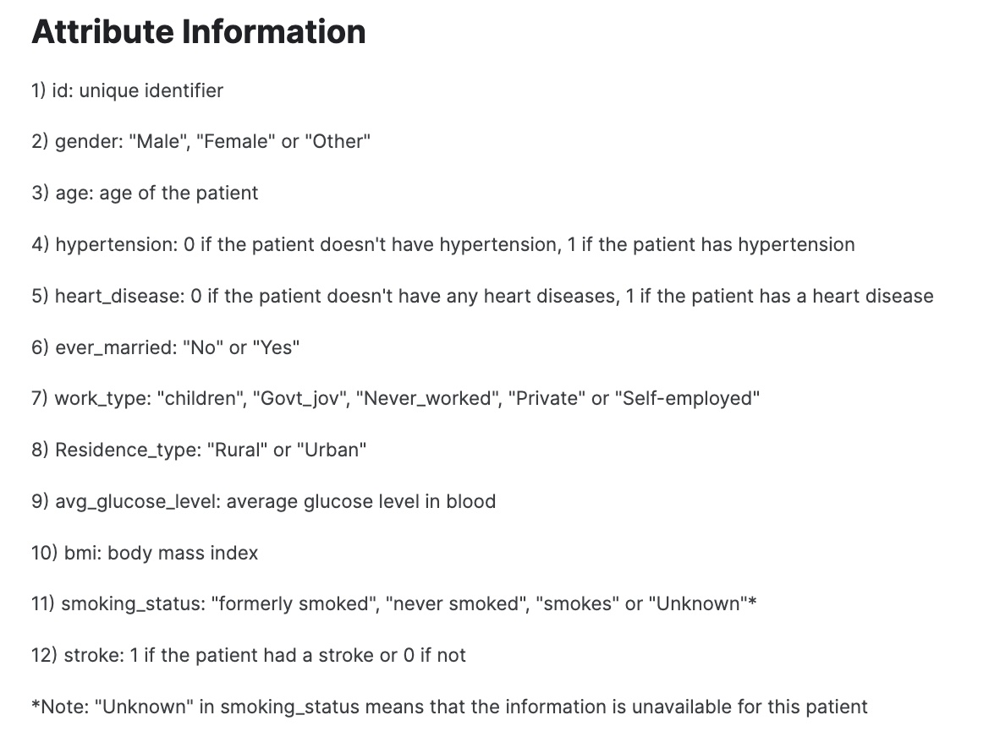

# Stroke Predictor

## Analysis and Classification of Strokes

**Author:** Jackson Muehlbauer

**Date:** 2/2/23

### Purpose:
There are roughly 800,000 strokes resulting in nearly 137,000 deaths in the United States per year [www.nichd.nih.gov]. The frequency and potentcy of strokes make it one of the leading causes of death and disability in the USA. As such, there is a great amount of benefit if mdeical advisors were able to predict which patients were the most at-risk for having a stroke. This would allow them to make recommendations for preventative medicines and lifestyle choices. The purpose of this project is to identify the leading risk factors for strokes as well as develop a model that will predict whether a patient will experience a stroke using readily available medical and personal information. This has the potential to be very useful information and a valuable too for medical professional as well as health concious individuals. 

Link to source data: https://www.kaggle.com/datasets/fedesoriano/stroke-prediction-dataset

### Description of Data:
Each row in this dataset corresponds to information regarding an individual patient. The target column in this exploration was the stroke column, which describes if the patient has had a stroke. The other available features are shown below in the dictionary.

**Dictionary:**

### Methods:
The data was prepared for analysis by checking for duplicated rows and missing entries for each feature. The unique values for the categorical features were checked for any inconsistencies and the ID column was dropped as it contained entirely unique values. Missing values were left untouched for the data exploration portion of this exercise. 

### Exploratory Data Analysis:

#### Numerical Features:
Each numerical feature was plotted as a histogram and a boxplot. This was done to understand more about the distribution of values of each class as well as visualize the # of outliers. For this exploration it was determined that age was fairly evenly distributed from ages 0 to ~80, the average glucose level had a bimodal distribution, and BMI had a normal distribution with some extreme right shifted outliers. 

#### Categorical Features:
Each categorical feature was plotted as a frequency bar chart to show the breakdowns for each class. It was determined that many of the features such as hypertension and heart disease had significant class imbalances. In addition to this, the target stroke column was also severely imbalanced to the point that only around 5% of individuals experience strokes. See the breakdown of the target below.

### Explanatory Data Analysis
Several multivariate visuals were made for the explanatory phase. One of which included a correlation heatmap between all numerical and bolean features. From this plot, it was discovered that there weren't any highly correlated features with respect to strokes and the highest of which was age. It also showed that many of the features such as BMI and hypertension were correlated with age. Box plots and violin plots were also made to learn of the relations between the numerical features and strokes, as well as age and the categorical features.

The visualization below shows the average age of those that had strokes as well is how it compares to those who did not/have not.

**Interpretation**

> Patients that experience strokes tend to be older. The smaller standard deviation for the strokes havers indicates a tighter distribution around the older ages. This could also be related to age being correlated to other potential risk factors such as heart disease.

**Interpretation**

> The three barchart show correlation between the features and higher rates of strokes for individuals over 60 years old. This is shown by the difference in stroke rate between the positive and negative (Yes and No) groups. The age filtering was done in attempt to decorrelate these features with the age column. After this decorrelation, there appears to be some increase in strokes for those that never married, have hypertension and have heart disease.

Note: There are others methods to decorrelated features, there is likely still correlation between the age column and the displayed features above.

## Machine Learning

The following modeling algorithyms were used to classify strokes in the population of patients:
- XGBoost
- Linear Regression
- KNN

These models were used in combination with two different sampling techniques to account for the class imbalance in the target. Additionally, principal component analysis (PCA) was implemented to reduce the number of features and improve the final models. The following sections further detail this effort. 

### Model Evaluation
It was determined that for this model to be effective, the recall score would be one of the most important metrics. This is because recall will punish false negatives, which in this case, would be a patient that was predicted to not have a stroke and end up having a stroke. This scenerio was deemed to be high cost due to the fact that it could result death or disability without effectively intervening. That said, the model could not only reduce a recall with no weight given to other metrics due to the fact that this may result in a highly inaccurate model, that tends to predict that all patients with have strokes. Thus, recall was treated as the primary metric, however, accuracy, ROC AUC, and f1 were also highly considered. 

### Preprocessing
For all of the models, the dataset was first prepared with a validation split. From this point, the missing values in the BMI column was imputed using the median, followed by scaling the numerical columns using a standard scaling. The categorical features were one hot encoded. 

The following three models (including a dummy model) were fit on the training data with three sampling techniques, the control (no resampling), undersampling, and SMOTE (a synthetic technique of oversampling). The best sampling technique was chosen for each model by comparing the model performance across sampling techniques. 

#### PCA

PCA was implemented on SMOTE sampled data and fed to a logistic regression model that was then evaluated. By comparing the metrics from this model to the base logistic regression model, it was determined that PCA had a positive impact on the model performance. 

### Hyperparameter Tuning
It was determined that XGBoost and Logistic regression had considerably higher metrics on the untuned model. Thus, these were the models that were tuned using GridSearchCV.

### XGBoost
The best performing model post tuning:
Used: Undersampling and PCA 

| Recall | f1 | ROC AUC | Accuracy |
|--------|----|---------|----------|
| 0.77   |0.23|  0.82  |    0.75   |

### Linear Regression
The best performing model post tuning:
Used: SMOTE and PCA

| Recall | f1 | ROC AUC | Accuracy |
|--------|----|---------|----------|
| 0.81   |0.23|  0.84  |    0.74   |

### KNN
KNN hyperparameters were not tuned as it did not perform nearly as well as the other two models. The best model is shown below:
Used: Undersampling

| Recall | f1 | ROC AUC | Accuracy |
|--------|----|---------|----------|
| 0.81   |0.19|  0.78  |    0.67   |

## Model Recommendations
Overall, the best tested model was the Logistic Regression model with SMOTE sampling, PCA with 95% retained variance, and the following hyperparameters:

{'C': 0.005, 'solver': 'lbfgs'}

This model had the best combination of f1, accuracy, ROC AUC and most importantly, recall scores. Recall was the primary evaluation metric due to the high cost of false negatives; however, there were cases when the recall score was high but there was a significant reduction in the other 3 scores. This means that the model was signicantly over predicting that people would have a stroke. While this certainly cut down on false negatives, the cost over so many false positives would be difficult to justify. Without knowing exact the cost of false negatives compared to that of false positives, the chosen model seemed to have the best combination of 4 metrics. The values of which are shown below:

| Recall | f1 | ROC AUC | Accuracy |
|--------|----|---------|----------|
| 0.81   |0.23|  0.84  |    0.74   |

## Limitations & Next Steps

Overall, none of the models were particularly high performing including the chosen "best" model. I would have serious concerns with implementing this model to make actionable decisions such as medication or other treatments. There are simply too many false negatives and false positives for this to be an extremely effective and high confidence tool. That said, it could be used by a physician as an internal "at-risk" marking tool. This would allow the physician to keep a closer eye on patients that may have a higher risk strokes. This may led to more extensive screenings to the extremely at-risk group which could potentially save lives. It could also be used to recommend healthier to certain at risk people. 

#### For further information

For any additional questions, please contact 
- Jackson Muehlbauer
- **jlmuehlbauer@gmail.com**

